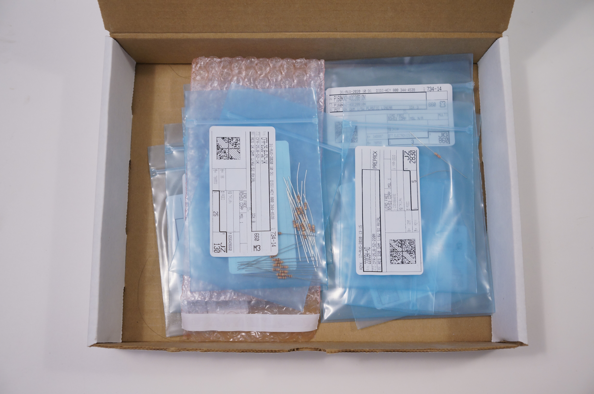
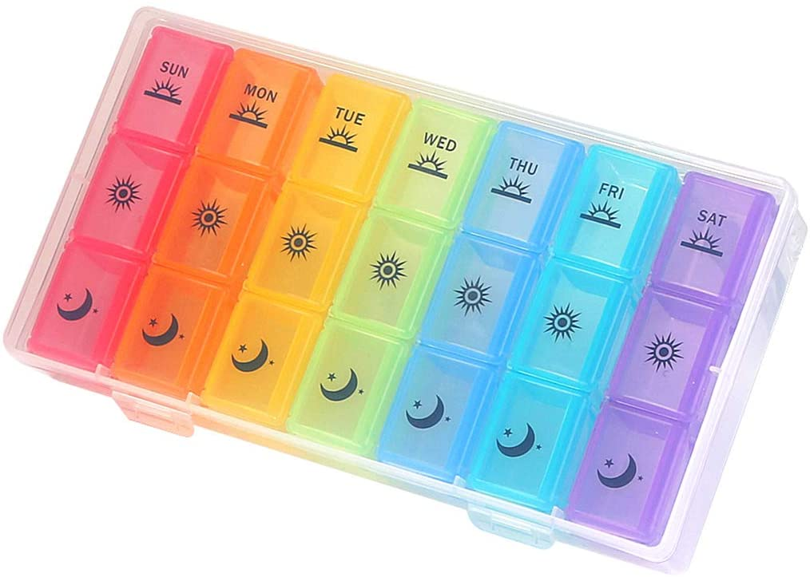
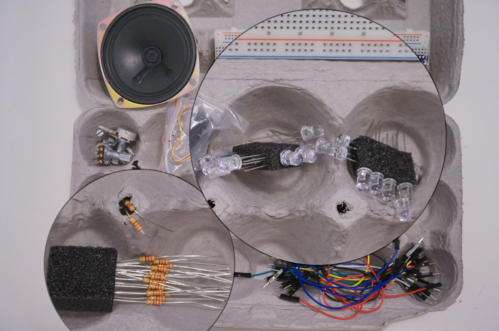

# PComp Labs Week 3

This is my blog post for working on week 3's labs.

## Another week, another setup change

So far, I've still been storing and organizing my parts in the bags they came in. Turns out, having a lot of tiny parts in flat bags stacked on top of each other is not the best way to find things!

<center>

</center>

I wanted to find a container that has a lot of different subcompartments, so that I can use each one to hold a different kind of part. I was about to order something like a pill box...

<center>

<br>
[<a href="https://www.amazon.com/Organizer-Compartments-Moisture-Proof-Medication-Supplements/dp/B07Q9JSHMP">Source</a>]
</center>

...when I got hungry and made food. I made some fried rice happened to use the last egg in the carton. Lo and behold, my new organization strategy was right in front of me!

<center>

</center>

Organizing my compartments this way ended up saving me a lot of time, frustration, and eyestrain compared to last week's lab -- I'd highly recommend it!

<center>

</center>

Note that the resistors and LEDs are pushed into foam blocks. This way they'll stay together even if the container gets jostled! I used the foam that came with the Arduino.

## Lab 1: Tone output

<https://itp.nyu.edu/physcomp/labs/labs-arduino-digital-and-analog/tone-output-using-an-arduino/>

### Controlling pitch with pressure

<center>
<video width="500" src="../files/2020-09-pcomp/week-3/1a_pressure_tones/MAH04979.MP4">
</center>

<details>
<summary>Code</summary>

```ino
void setup() {  //
  // tone(8, 440, 10000);
}

void loop() {
  // get a sensor reading:
  int sensorReading = analogRead(A0);
  debugInt(sensorReading, " ; ");

  // map the results from the sensor reading's range
  // to the desired pitch range:
  float frequency = map(sensorReading, 0, 950, 300, 800);
  if (frequency < 0) frequency = 0;
  debugInt(frequency, " ; ");
  // change the pitch, play for 10 ms:
  Serial.print("\n");
  tone(8, frequency, 300);
  delay(300);
}
```

</details>

I found that using `Serial.println` to log multiple lines gets pretty hard to read because of the fast-scrolling input, so I created `debugInt` to help with that.

<details>
<summary>Code</summary>

```ino
#define debugInt(varname, suffix) \
  Serial.print(#varname);         \
  Serial.print(" = ");            \
  printLpad((varname), 3);        \
  Serial.print((suffix));

void printLpad(int x, int length) {
  int digits = x == 0 ? 1 : floor(log10(abs(x))) + 1;
  for (int i = digits; i < length; i++) {
    Serial.print(" ");
  }
  Serial.print(x);
}
```

</details>

How it's used:

```ino
void loop() {
  int sensorReading = ...
  debugInt(sensorReading, " ; ");

  int frequency = ...;
  debugInt(frequency, "\n");
}
```

The output looks like:

```out
sensorReading =   0; frequency = 300
sensorReading = 603; frequency = 617
sensorReading = 877; frequency = 761
sensorReading = 923; frequency = 785
sensorReading = 159; frequency = 383
sensorReading =  35; frequency = 318
sensorReading = 773; frequency = 706
sensorReading = 914; frequency = 781
sensorReading =   5; frequency = 302
sensorReading = 720; frequency = 678
sensorReading = 916; frequency = 782
```

Super aligned and easy-to-read!

### Playing a melody

<center>
<video width="500" src="../files/2020-09-pcomp/week-3/1b_melody/MAH04977.MP4">
</center>

<details>
<summary>Code</summary>

```ino
#include "pitches.h"

// notes in the melody:
int melody[] = {NOTE_C4, NOTE_G3, NOTE_G3, NOTE_GS3,
                NOTE_G3, 0,       NOTE_B3, NOTE_C4};

// note durations: 4 = quarter note, 8 = eighth note, etc.:
int noteDurations[] = {4, 8, 8, 4, 4, 4, 4, 4};

void setup() {}

void loop() {
  // iterate over the notes of the melody:
  for (int thisNote = 0; thisNote < 8; thisNote++) {
    // to calculate the note duration, take one second
    // divided by the note type.
    // e.g. quarter note = 1000 / 4, eighth note = 1000/8, etc.
    int noteDuration = 1000 / noteDurations[thisNote];
    tone(8, melody[thisNote], noteDuration);

    // pause for the note's duration plus 30 ms:
    delay(noteDuration + 30);
  }
}
```

</details>

Modifications from the given code: none.

### Making a musical instrument

<center>
<video width="500" src="../files/2020-09-pcomp/week-3/2_servo/DSC04986-ANIMATION.gif">
</center>

<details>
<summary>Code</summary>

```ino
#include "pitches.h"

// minimum reading of the sensors that generates a note
const int threshold = 100;
const int speakerPin = 8;      // pin number for the speaker
const int noteDuration = 300;  // play notes for 20 ms

// notes to play, corresponding to the 3 sensors:
int notes[] = {NOTE_A4, NOTE_B4, NOTE_C5};

void setup() {}

void loop() {
  for (int thisSensor = 0; thisSensor < 3; thisSensor++) {
    // get a sensor reading:
    int sensorReading = analogRead(thisSensor);

    // if the sensor is pressed hard enough:
    if (sensorReading > threshold) {
      // play the note corresponding to this sensor:
      tone(speakerPin, notes[thisSensor], noteDuration);
    }
  }
  delay(noteDuration);
}
```

</details>

Modifications from the given code:

- Increased `threshold`: `10` -> `100`
- The given code did not play a continuous tone -- it would click continuously as each call to `tone()` overrode the previous call to `tone()`. These two changes largely mitigated the problem.
  - Increased `noteDuration`: `20` -> `300`.
  - Added `delay(noteDuration);` at the end of `loop()`. (`tone()` appears to play the tone asynchronously, so we should add a slightly long delay to reduce the amount of clicking.)

## Lab 2: Servo motor control

<https://itp.nyu.edu/physcomp/labs/labs-arduino-digital-and-analog/servo-motor-control-with-an-arduino/>

<center>

</center>

<details>
<summary>Code</summary>

```ino
#include "Servo.h"  // include the servo library

Servo servoMotor;  // creates an instance of the servo object to control a servo
int servoPin = 3;  // Control pin for servo motor

void setup() {
  Serial.begin(9600);  // initialize serial communications
  // attaches the servo on pin 3 to the servo object
  servoMotor.attach(servoPin);
}

void loop() {
  int analogValue = analogRead(A0);  // read the analog input
  Serial.println(analogValue);       // print it

  // if your sensor's range is less than 0 to 1023, you'll need to
  // modify the map() function to use the values you discovered:
  int servoAngle = map(analogValue, 0, 1023, 0, 179);

  // move the servo using the angle from the sensor:
  servoMotor.write(servoAngle);
}
```

</details>
